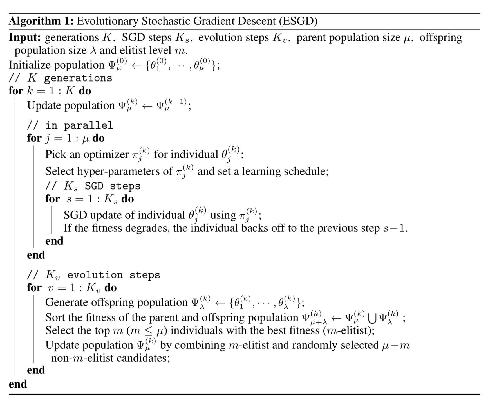
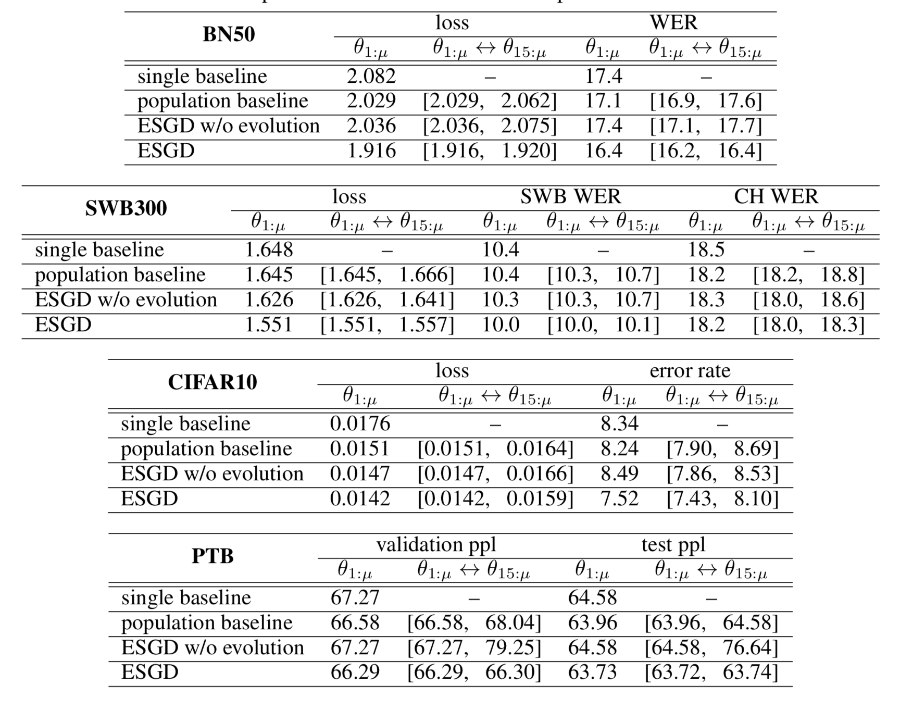
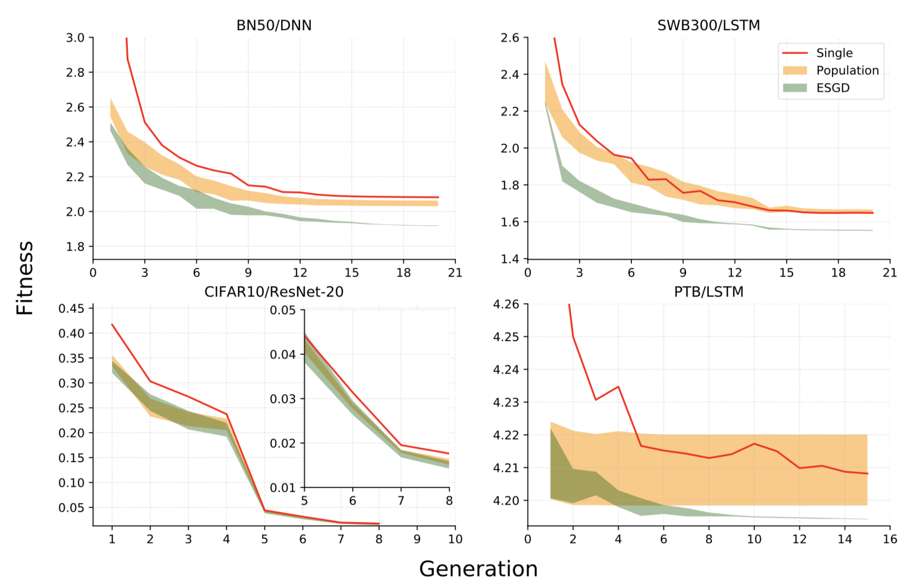
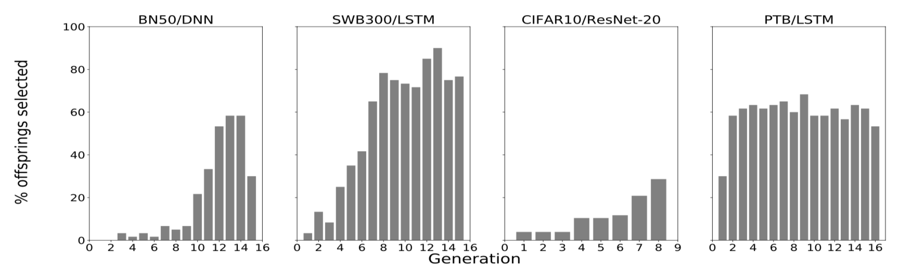

> Evolutionary Stochastic Gradient Descent for Optimization of Deep Neural Networks. NeurIPS 2018 [(paper link)](http://papers.nips.cc/paper/7844-evolutionary-stochastic-gradient-descent-for-optimization-of-deep-neural-networks.pdf)

## 背景

本文介绍由IBM Research AI的Xiaodong Cui等作者于NeurIPS 2018发表的一个基于种群的进化随机梯度下降深度神经网络优化算法框架\[1\]。

随机梯度下降是目前深度学习主流优化方法\[2\]。与此同时，代表黑盒优化的无梯度进化算法也出现在各种应用中\[3\]。此类进化优化算法适合于非线形非凸非平滑的优化问题，受生物学研究启发，其对一般优化目标函数不做任何分析形式的假设。在深度学习应用中，遗传算法和进化策略已经被用于深度强化学习和神经网络架构搜索\[4\]，但并没有被有效应用于优化最先进的复杂深度神经网络的大规模参数中。

因为随机梯度下降依赖于显式的目标函数梯度，而无梯度进化算法可以大规模并行优化复杂或知之甚少的目标函数，作者结合两者的优点提出了一个称为进化随机梯度下降的优化方法。简单来说，该算法将种群定义为一个以候选模型参数为个体的集合，并令该种群轮流进行类似生物学的成长和协同进化行为。在成长阶段，每个候选模型参数个体也可以被视为一个物种，其根据一套传统优化方法的参数进行独立成长发育；在协同进化阶段，所有个体允许相互交流并产生下一代种群。细节将会在接下来的章节中展开。

本文接下来的部分组织如下：笔者将先给出一个简洁的问题定义，然后详细展开作者提出的算法细节以及定理，其后附上部分相关实验结果，最后是一些对该算法的优缺点的讨论。

## 问题描述

在一个监督学习问题中，假设$$\mathcal{X} \subseteq \mathbb{R}^{d_x}, \mathcal{Y} \subseteq \mathbb{R}^{d_y}$$分别为输入和输出空间，问题的学习目标通常为估计一个从输入到输出的映射：

$$h(x;\theta): \mathcal{X} \rightarrow \mathcal{Y}$$

其中$$x \in \mathcal{X}$$且$$h$$属于由$$\theta \in \mathbb{R}^d$$参数化的函数族。定义在$$\mathcal{X} \times \mathcal{Y}$$上的损失函数$$\ell(h(x;\theta), y)$$衡量预测$$h(x;\theta)$$和标签$$y$$的相近程度。一个$$\theta$$的风险函数可以被定义为数据联合分布下的期望损失：

$$R(\theta) = \mathbb{E}_{(x, y)}[\ell(h(x;\theta), y)]$$

于是目标通常是找到一个最小化该期望风险的函数$$h(x;\theta^*)$$。在实际情况下，我们一般只能获得一些独立同分布的训练样本$$\{(x_i, y_i)\}_{i = 1}^n \in \mathcal{X} \times \mathcal{Y}$$，而无法获取真实数据分布$$p(x, y)$$。所以学习目标转化为最小化如下经验风险：

$$R_n(\theta) = \frac{1}{n}\sum_{i = 1}^n\ell(h(x_i;\theta), y_i) \triangleq \frac{1}{n}\sum_{i = 1}^n l_i(\theta)$$

其中$$l_i(\theta) \triangleq \ell(h(x_i;\theta), y_i)$$。随机规划可简化上式为：

$$R_n(\theta) = \mathbb{E}_\omega[l_\omega(\theta)]$$

其中$$\omega \sim Uniform\{1,\dots,n\}$$。在传统随机梯度下降的第$$k$$次迭代中，通常会随机选取一个样本$$(x_{i_k}, x_{i_k}), i_k \in \{1,\dots,n\}$$，计算随机梯度$$\nabla l_{i_k}$$，并根据一个合适的步长$$\alpha_k > 0$$更新参数：

$$\theta_{k + 1} = \theta_k - \alpha_k \nabla l_{i_k} (\theta_k)$$

传统随机梯度下降一般只考虑一个单独的参数向量$$\theta$$。我们不妨假设参数满足一个分布$$\theta \sim p(\theta)$$并定义如下在$$p(\theta)$$分布上的期望经验风险：

$$J = \mathbb{E}_\theta[R_n(\theta)] = \mathbb{E}_\theta[\mathbb{E}_\omega[l_\omega(\theta)]]$$

类似地，在实际应用中，考虑$$\mu$$个候选参数$$\{\theta_j\}_{j = 1}^\mu$$。最终我们对以下种群的平均经验风险感兴趣：

$$J_\mu = \frac{1}{\mu}\sum_{j = 1}^\mu R_n(\theta_j) = \frac{1}{\mu}\sum_{j = 1}^\mu ( \frac{1}{n}\sum_{i = 1}^n l_i(\theta) )$$

通常适应度为越大越好，对应于风险越小越好，这里将风险函数$$R_n$$对应种群中一个物种个体的适应性函数。于是，最终的学习目标即为选择$$\{\theta_j\}_{j = 1}^\mu$$的一个子集以最小化$$J_\mu$$。

此外，$$m$$-精英平均适应度被定义为前$$m$$个最好的个体($$1 \leq m \leq \mu$$)的平均适应度：

$$J_{\bar{m}:\mu} = \frac{1}{m}\sum_{k = 1}^m f(\theta_{k:\mu})$$

其中$$\theta_{k:\mu}$$表示$$\Psi_\mu = \{\theta_1, \dots, \theta_\mu\}$$中适应度第$$k$$最高的个体，$$f(\theta)$$为一个适应性度量函数。

## 算法

进化随机梯度下降算法迭代地优化上节定义的$$m$$-精英平均适应度，其伪代码如下：

首先，该算法初始化拥有$$\mu$$个个体的父种群$$\Psi_\mu^{(0)}=\{\theta_1^{(0)}, \dots, \theta_\mu^{(0)}\}$$，这可以采用随机初始化参数或随机扰动已有模型参数。每一代种群交替执行传统随机梯度下降以及无梯度进化算子来改进目标函数$$J_{\bar{m}:\mu}$$，以此逐代进化。在传统随机梯度下降步骤中，每个个体$$\theta_j$$选择一个优化器$$\pi_j$$、超参数及学习安排独立学习更新参数共$$K_s$$步。优化器、超参数可以来自一个预设的集合，而个体从集合中随机选择元素并组合。退火策略可以让学习率逐代递减。从进化算法的角度来说，随机梯度下降步骤中，个体之间没有相互交流，对应于物种之间的基因隔离被保留。如果在梯度下降过程中适应度有所下降，则该个体会退回到梯度下降前一步，此策略称为后退。所有个体独立进行随机梯度下降之后，将进行无梯度协同进化步骤。在这一步中，种群中所有个体将被允许交互、组合、产生后代、变异等行为并产生拥有$$\lambda$$个个体的后代种群$$\Psi_\lambda$$。这里可以采用任意进化算法，而原文利用了$$(\mu / \rho + \lambda)$$-进化策略算法。更明确的说，在进化过程中，其首先会从当前种群$$\Psi_\mu^{(k)}$$中以基于适应度的比例选择算子得到$$\rho$$个物种个体，并以平均重组加高斯噪声的方式产生出$$\lambda$$个后代：

$$\theta_i^{(k)} = \frac{1}{\rho} \sum_{j = 1}^\rho \theta_j^{(k)} + \epsilon_i^{(k)}$$

其中$$\theta_i^{(k)} \in \Psi_\lambda^{(k)}，\theta_j^{(k)} \in \Psi_\mu^{(k)}，\epsilon_i^{(k)} \sim \mathcal{N}(0, \sigma_k^2)$$。类似的，$$\sigma_k^2$$也可以用一种退火策略逐代递减。至此，包括后代的综合种群为$$\Psi_{\mu + \lambda} = \Psi_\mu \cup \Psi_\lambda$$。一种称为$$m$$-精英策略的物种选择方法会从$$\Psi_{\mu + \lambda}$$中选择$$m$$($$m \leq \mu$$)个拥有最高适应度的个体，并从剩余的个体中随机选取$$\mu - m$$个个体。假设当前为第$$k$$代，则上述被选择的个体组成下一代的父种群$$\Psi_\mu^{(t + 1)}$$。详细算法实现细节请读者参考原文。

该进化随机梯度下降算法具有$$m$$-精英平均适应度不退化的性质，即目标函数$$J_{\bar{m}:\mu}^{(k)}$$随着$$k$$增大不递增。相关定理及推论如下：

**定理1.** 已知$$\Psi_\mu$$为一个拥有$$\mu$$个物种个体的种群$$\{\theta_j\}_{j = 1}^\mu$$。假设$$\Psi_\mu$$根据包含后退策略和$$m$$-精英策略的进化随机梯度下降算法进行进化，则对于每一代$$k$$，

$$J_{\bar{m}:\mu}^{(k)} \leq J_{\bar{m}:\mu}^{(k - 1)}，k \geq 1$$

**推论1.** $$\forall m'，1 \leq m' \leq m$$，可得

$$J_{\bar{m}':\mu}^{(k)} \leq J_{\bar{m}':\mu}^{(k - 1)}，k \geq 1。$$

尤其是当$$m' = 1$$，可得

$$f^{(k)}(\theta_{1:\mu}) \leq f^{(k - 1)}(\theta_{1:\mu})，k \geq 1$$

换言之，种群中适应度最高的个体保证不会退化。以上定理的详细证明可参见原文附录，简而言之，证明的关键点在于后退策略提供的保障。

## 实验

作者在实验中采用了4个数据集：BN50、SWB300、CIFAR10、PTB，前二者对应大词汇量连续语音识别，后两者分别对应图像识别和语言模型任务。作者同时也实现了两种参照系统作为对照基准。第一种基准系统称为单一基准，是数据集任务对应领域的一种最先进的经过精细设计和调参的模型，其参数、训练方式皆为单一固定的；第二种系统称为种群基准，其随机初始化与提出算法相同数量的个体，并同时训练，不包括协同进化步骤，此为模拟经典深度神经网络训练的超参数调整过程。作者同时将进化算子移除而进行了控制变量实验。主要实验结果如下表：

其中WER代表词错误率，SWB和CH分别是SWB300数据集中的两种数据，ppl表示损失函数值的指数。实验结果表明，提出的进化随机梯度下降算法相较于传统优化方法以及无进化模块的简化算法，在最先进的深层神经网络模型以及热门模式识别应用上，有较明显的效果提升。

下图为各个方法的目标函数（适应度）关于当前进化代数的折线图，其中种群基准对照方法和提出的方法以带状表示种群个体的适应度的分布。我们可以看出，进化随机梯度下降算法的下界，即适应度最高的个体，确实是根据定理1不退化的。

作者最后研究了进化步骤中产生的后代在下一代中被选择的比例随进化逐代的变化。结果如下图。我们可以看出，在初始几代，随机梯度下降占主导地位。这主要是因为训练前期参数变化较大，方差较大的平均重组策略不容易得到适应度比父种群较高的个体。而在进化末期几代，不同优化器的超参数之间的交互对产生精英后代有着至关重要的作用。

## 讨论

原文作者提出了一种结合传统随机梯度下降优化算法和无梯度进化算法的优势的深度神经网络优化算法框架。

该方法优势在于其直观的概念以及简单有效的保证最优个体不退化的定理，其较大的优化算法超参数搜索空间几乎可以保证其最终效果比精细设计模型后单一训练及手动调参训练有一定明显的提升。其一般性的框架可以采用梯度优化算法及基因进化算法领域的最新研究成果。目前来说，所有个体独立进行随机梯度下降及协同进化都有大规模并行的方法\[5\]\[6\]。

该方法也有一定的局限性。遗传进化算法通常需要足够数量的个体保证多样性及超参数空间覆盖率才能取得较好的效果。对于大规模深度神经网络而言，即使种群中只有几十个个体，完全并行的环境也将需要较大昂贵的计算资源。基于进化策略的黑盒优化算法可以视为利用一定数量的个体计算当前损失函数对于参数的近似梯度，而数量有限的个体产生的梯度与真正的梯度有一定因噪声造成的偏差\[7\]。当然，随机梯度下降步骤在一定程度上降低了进化步骤的随机性的影响。从算法伪代码及描述中，我们可以看出该算法在实现过程中也需要较多关于进化算子以及预设优化器的超参数的设定。所以总体来说，该算法框架在转换为实现的时候也不能避免较为精细的参数调整过程。原文提出的算法及实验皆假设固定的深度神经网络结构，而事实上神经网络的架构对特定模式识别任务的效果也有较大的影响。如何在该算法基础上增加网络架构搜索而不过多增加随机性和复杂度也是一个有趣的研究方向。

## 参考文献

1. Cui, Xiaodong, Wei Zhang, Zoltán Tüske, and Michael Picheny. "Evolutionary stochastic gradient descent for optimization of deep neural networks." In Advances in neural information processing systems, pp. 6048-6058. 2018.
2. Bottou, Léon, Frank E. Curtis, and Jorge Nocedal. "Optimization methods for large-scale machine learning." Siam Review 60, no. 2 (2018): 223-311.
3. Loshchilov, Ilya. "LM-CMA: An alternative to L-BFGS for large-scale black box optimization." Evolutionary computation 25, no. 1 (2017): 143-171.
4. Real, Esteban, Sherry Moore, Andrew Selle, Saurabh Saxena, Yutaka Leon Suematsu, Jie Tan, Quoc V. Le, and Alexey Kurakin. "Large-scale evolution of image classifiers." In Proceedings of the 34th International Conference on Machine Learning-Volume 70, pp. 2902-2911. JMLR. org, 2017.
5. Such, Felipe Petroski, Vashisht Madhavan, Edoardo Conti, Joel Lehman, Kenneth O. Stanley, and Jeff Clune. "Deep neuroevolution: Genetic algorithms are a competitive alternative for training deep neural networks for reinforcement learning." arXiv preprint arXiv:1712.06567 (2017).
6. Salimans, Tim, Jonathan Ho, Xi Chen, Szymon Sidor, and Ilya Sutskever. "Evolution strategies as a scalable alternative to reinforcement learning." arXiv preprint arXiv:1703.03864 (2017).
7. Zhang, Xingwen, Jeff Clune, and Kenneth O. Stanley. "On the relationship between the openai evolution strategy and stochastic gradient descent." arXiv preprint arXiv:1712.06564 (2017).
